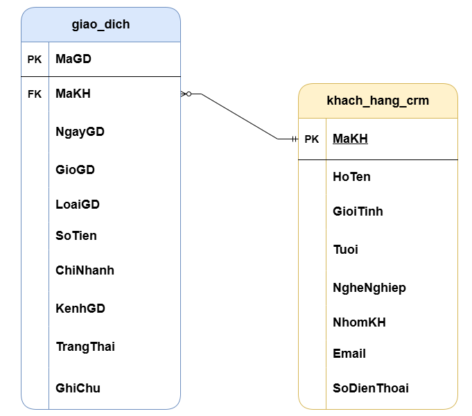
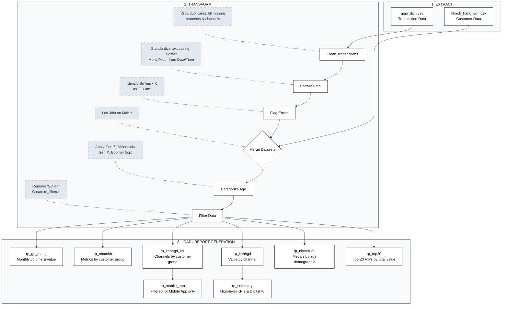
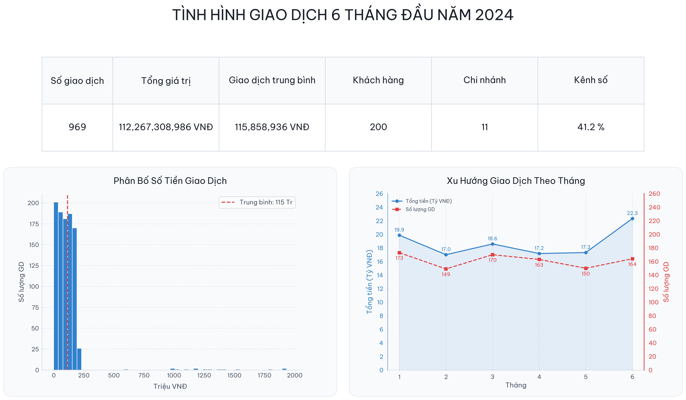
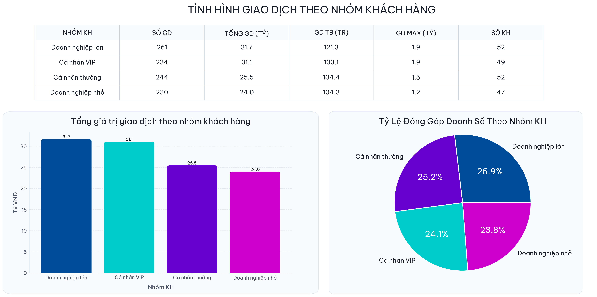
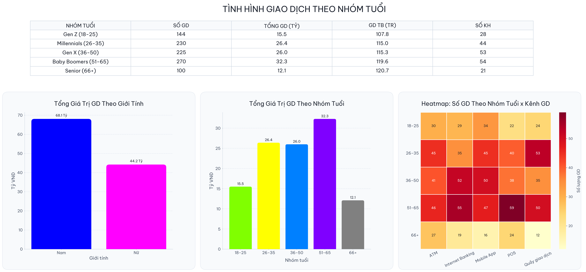
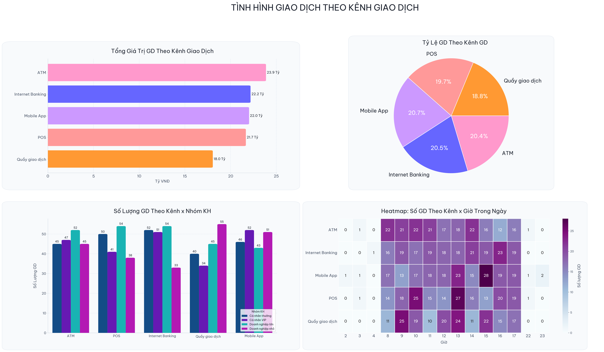
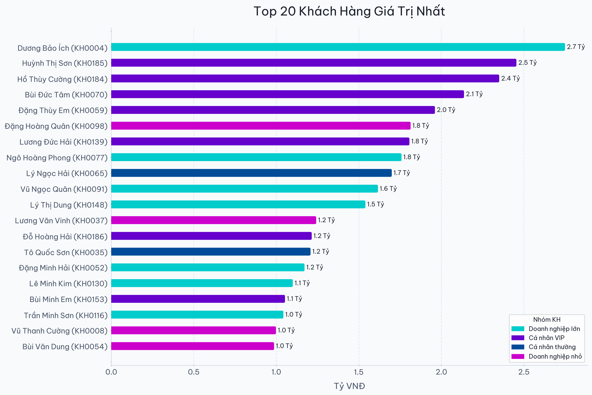

# Python basic EDA
## Overview
The project use Pandas, Matplotlib, and Seaborn library to build an ETL pipeline, clean data, and perform Exploratory Data Analysis (EDA) tasks from 2 mock datasets of 6-month transaction status of an imaginary company with ~1000 records.
This project involves:
1. **Building ETL Pipeline**: Create a Python function to get data from .csv files, clean data, perform EDA, and load.  
2. **Building Dashboards**: Using Matplotlib and Seaborn library to perform data visualization.    

:dart: **Target:** Build dashboards serving data analytical tasks.
   
**Tool use:** Google Colab  
Colab link: https://colab.research.google.com/drive/1qsGXKG2r0xVvjwwBlggaUjjneOza0b3i#scrollTo=bUDeAeVwRBed&uniqifier=6

---
## Building ETL Pipeline
### Datasets
_`giao_dich.csv`_  
Sample of first 5 rows:
| MaGD | MaKH | NgayGD | GioGD | LoaiGD | SoTien | ChiNhanh | KenhGD | TrangThai | GhiChu |
|---|---|---|---|-----------|---|---|---|---|---|
| GD000508 | KH0124 | 2024-02-17 | 16:16 | Mua ngoại tệ | 165717229 | Hà Nội | Mobile App | Thành công | nan |
| GD000082 | KH0198 | 2024-01-08 | 16:04 | Nạp tiền | 20738329 | Khánh Hòa | ATM | Thành công | nan |
| GD000091 | KH0033 | 2024-01-24 | 13:07 | Chuyển khoản | 154100866 | Đồng Nai | Internet Banking | Thành công | nan |
| GD000193 | KH0095 | 2024-06-30 | 16:02 | Chuyển khoản | 58005231 | Nghệ An | POS | Thành công | nan |
| GD000474 | KH0133 | 2024-06-02 | 17:27 | Rút tiền | 165478158 | Đồng Nai | POS | Thành công | nan |

_`khach_hang_crm.csv`_  
Sample of first 5 rows:
| MaKH | HoTen | GioiTinh | Tuoi | NgheNghiep | NhomKH | Email | SoDienThoai |
|---|---|---|---|---|---|---|---|
| KH0001 | Phạm Văn Ích | Nam | 34 | Giáo viên | Cá nhân thường | kh0001@email.com | 983197857 |
| KH0002 | Lê Bảo Oanh | Nam | 21 | Kinh doanh tự do | Cá nhân VIP | kh0002@email.com | 941227216 |
| KH0003 | Tạ Bảo An | Nam | 65 | Luật sư | Doanh nghiệp lớn | kh0003@email.com | 939587039 |
| KH0004 | Dương Bảo Ích | Nam | 68 | Giáo viên | Doanh nghiệp lớn | kh0004@email.com | 955667651 |
| KH0005 | Võ Hoàng Giang | Nữ | 26 | Kinh doanh tự do | Doanh nghiệp lớn | kh0005@email.com | 922981052 |

### Schema
<!---->

### ETL Pipeline

---
## Building Dashboards
 
--
 
--
 
--
 
--
 

